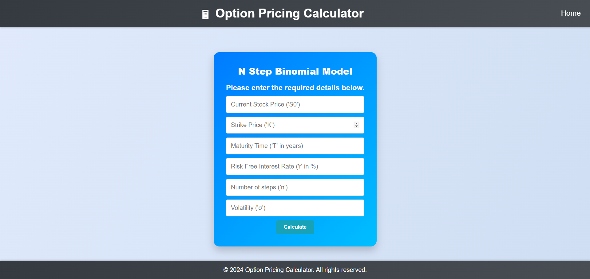

# Option Pricing Calculator

## Introduction

Welcome to the Option Pricing Calculator! This Django web application allows you to calculate the price of call and put options for stocks using different models. You can choose between the Two-Step Binomial Model, the N-Step Binomial Model, and the Black-Scholes Model to perform your calculations.

## Features

- **Two-Step Binomial Model**: Calculates option prices using a two-step binomial tree.
- **N-Step Binomial Model**: Allows you to specify the number of steps for a more detailed calculation.
- **Black-Scholes Model**: Uses the Black-Scholes formula to calculate option prices.

## WebPages

### Home Page


### Calculation page


### Result page


## Usage

### How to Use

1. **Clone the Repository**:
    ```sh
    git clone https://github.com/r-8848/Option-Pricing-Calculator.git

3. **Install Dependencies**:
     ```sh
     pip install -r requirements.txt

5. **Run the Application**:
     ```sh
     python manage.py runserver

7. **Access the Application**:
Open your web browser and go to `http://localhost:8000` to use the application.

### How It Works

1. **Choose a Model**: On the home page, select one of the three models:
   - Two-Step Binomial Model
   - N-Step Binomial Model
   - Black-Scholes Model

2. **Enter Stock Information**: Provide the necessary details for the stock and the option, such as:
   - Current stock price
   - Strike price
   - Time to expiration
   - Volatility
   - Risk-free interest rate
   - Dividend yield (if any)

3. **Calculate Option Price**: Click the button to calculate the option price. The result will display the prices for both call and put options.

### 🤝 Collaboration

We welcome contributions from the community! Here’s how you can get involved:

1. **Fork the Repository**: Click the "Fork" button on the top right to get a copy of the repository.
2. **Clone Your Fork**: Use `git clone <your-fork-url>` to clone your forked repository to your local machine.
3. **Create a Branch**: Use `git checkout -b feature-name` to create a new branch.
4. **Make Changes**: Implement your changes and commit them with clear and descriptive messages.
5. **Push Your Changes**: Use `git push origin feature-name` to push your changes to your fork.
6. **Create a Pull Request**: Go to the original repository and create a pull request, describing your changes and the reasons for them.
